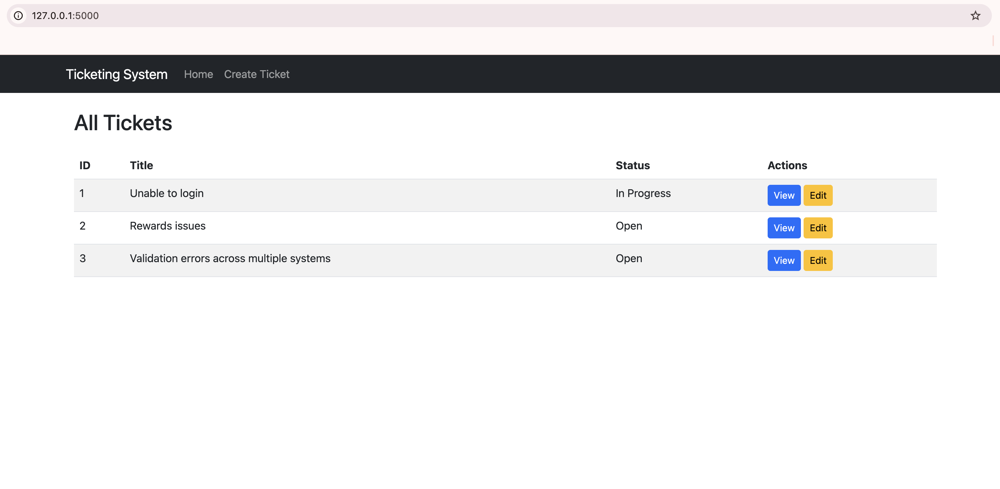
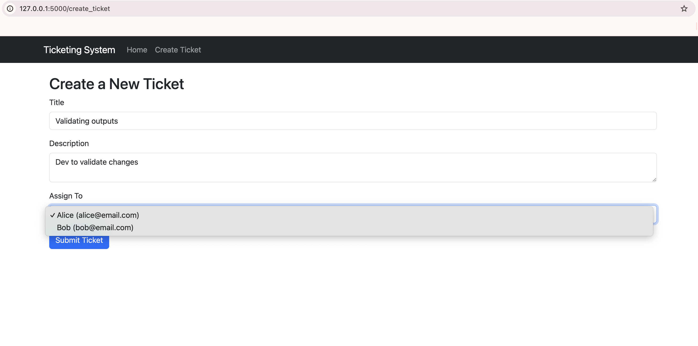
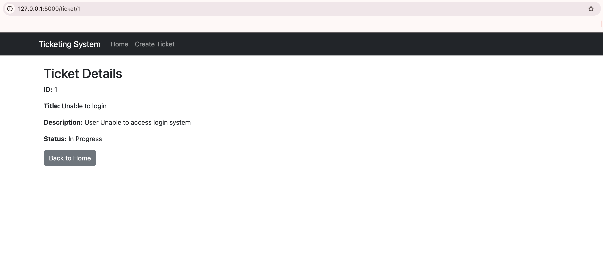
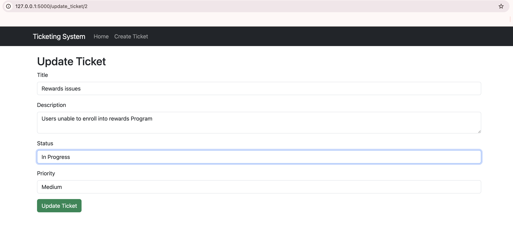

# Online Ticketing System

## 📌 Project Overview
This project is a Flask-based Online Ticketing System that allows users to create, manage, and track tickets efficiently using a web interface.

## 🎯 Purpose & Value
The system enables seamless task tracking and ticket management with real-time updates using Flask-SocketIO. It helps teams collaborate efficiently by allowing instant ticket updates, assignments, and modifications.

## 🛠️ Technologies Used
- **Flask** – Backend framework
- **Bootstrap** – Frontend styling
- **Flask-SocketIO** – Real-time updates
- **SQLAlchemy** – Database ORM
- **JavaScript (Fetch API)** – Handles API calls

---

## 📸 Screenshots

### **1️⃣ Home Page**
Displays all tickets with options to view and update them.

### **2️⃣ Creating a Ticket**
Users can create a new ticket with a title, description, and assign it to an existing user.

### **3️⃣ Viewing a Ticket**
Shows the details of a selected ticket.

### **4️⃣ Updating a Ticket**
Users can modify the ticket title, description, status, and priority.

---