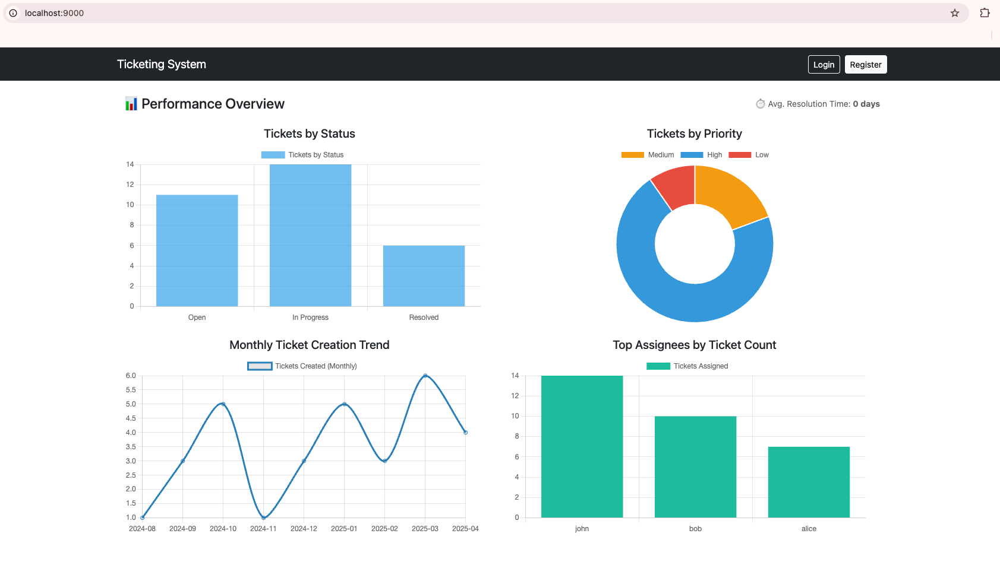
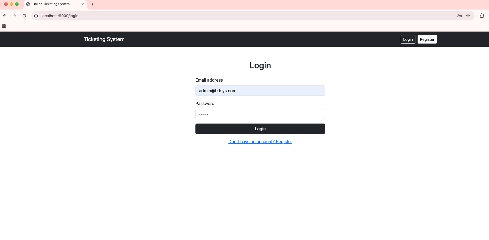
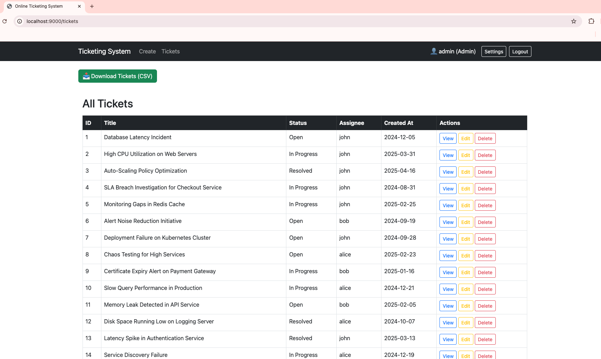
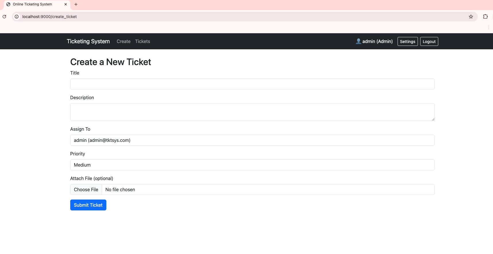
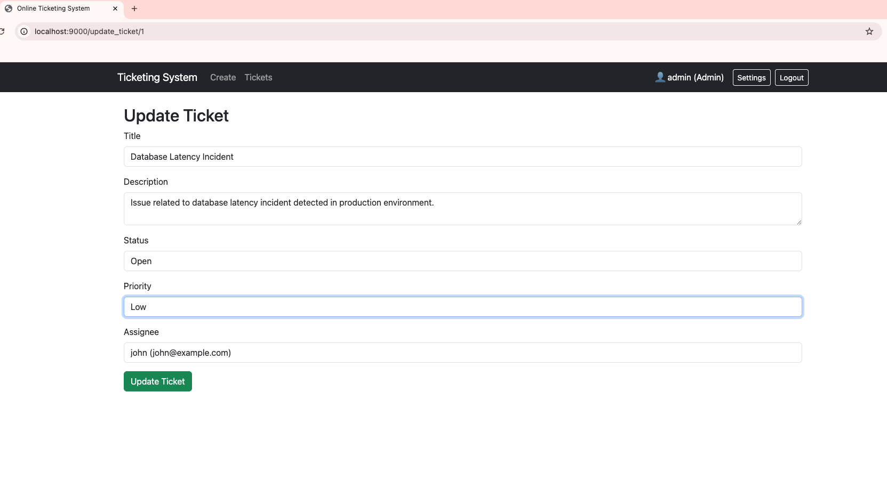
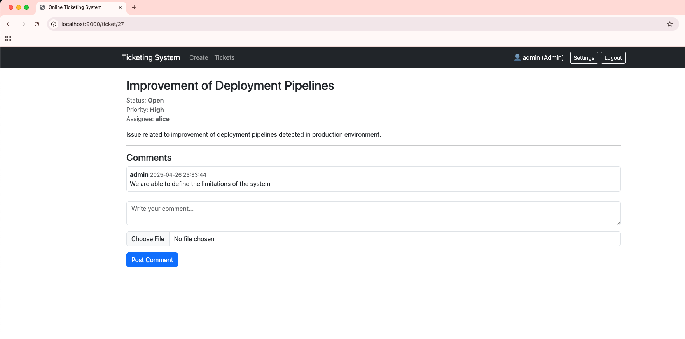
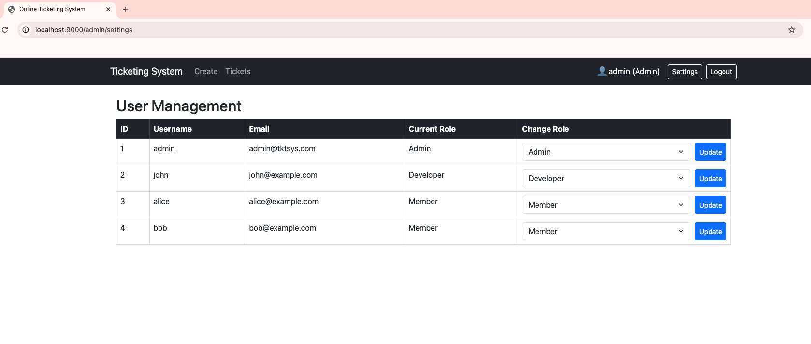
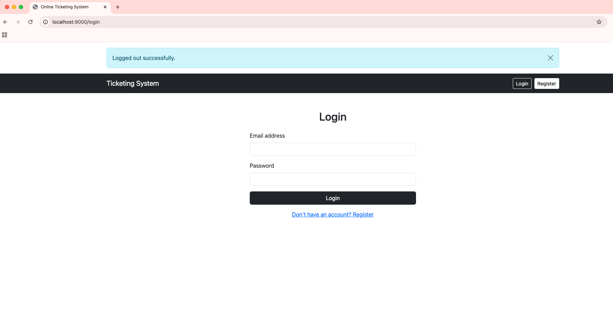

# Online Ticketing System

A modern, user-friendly support ticket management system built with Flask. This system helps teams efficiently track, manage, and resolve support tickets with real-time updates and collaboration features.

## 🎯 What This System Does

### For Support Teams
- **Efficient Ticket Management**: Create, update, and track tickets through their entire lifecycle
- **Real-time Collaboration**: Team members can instantly see updates and comments on tickets
- **File Attachments**: Share relevant documents, screenshots, or logs directly in tickets
- **Priority Management**: Clearly mark and filter tickets by priority (Low, Medium, High)
- **Export Capabilities**: Download ticket data as CSV for reporting and analysis

### For Users
- **Simple Interface**: Clean, intuitive design for easy ticket submission and tracking
- **Instant Updates**: Get real-time notifications when your ticket is updated
- **File Sharing**: Attach relevant files to help support teams understand your issue
- **Comment Threads**: Have detailed discussions with support staff in the ticket thread
- **Status Tracking**: Always know where your ticket stands in the resolution process

## 🖼️ Application Screenshots

### 1. Home Page

- Dashboard with ticket statistics and charts
- Visual representation of ticket status and priority distribution
- Monthly trends and top contributors analysis

### 2. Login Screen

- Secure authentication system
- Role-based access control
- Clean and intuitive login interface

### 3. Tickets Management

- Comprehensive list of all tickets
- Quick access to ticket details
- Status and priority indicators
- Export functionality for data analysis

### 4. Create Ticket

- Simple ticket creation form
- Priority selection
- File attachment support
- Assignee selection

### 5. Update Ticket

- Edit ticket details
- Status updates
- Priority changes
- Assignee management

### 6. Comments & Collaboration

- Real-time comment updates
- File attachments in comments
- User typing indicators
- Instant notifications for assigned tickets

### 7. User Management

- User role management
- Access control settings
- User activity tracking

### 8. Secure Logout

- Secure session termination
- Clear user feedback
- Easy re-login option

## 📹 Demo Video
Watch the full demo of the Online Ticketing System in action:
[](https://www.youtube.com/watch?v=kdr3DDD5XiI)

## 🚀 Getting Started

### Prerequisites
- Python 3.8 or higher
- Docker and Docker Compose (for Docker setup)
- Git
- Poetry (for local development)

### Quick Start with Docker (Recommended)
```bash
# Clone the repository
git clone <repository-url>
cd online-ticketing-system

# Copy environment template and update with your settings
cp .env.example .env

# Start the application
docker-compose up --build
```
Visit `http://localhost:5000` to access the application.

### Local Development Setup
```bash
# Install Poetry if not already installed
curl -sSL https://install.python-poetry.org | python3 -

# Clone the repository
git clone <repository-url>
cd online-ticketing-system

# Install dependencies
poetry install

# Copy environment template and update with your settings
cp .env.example .env

# Start the development server
poetry run python run.py
```

## 🔍 Key Features in Detail

### 1. Ticket Management
- **Create Tickets**: Submit new tickets with title, description, and priority level
- **Update Tickets**: Modify ticket details, status, and assignees
- **Delete Tickets**: Remove resolved or duplicate tickets
- **View History**: Track all changes made to a ticket
- **Export Data**: Download ticket information in CSV format

### 2. Real-time Updates
- **Instant Notifications**: Get notified immediately when tickets are updated
- **Live Comments**: See new comments appear in real-time
- **Status Changes**: Track ticket status changes as they happen
- **Assignee Updates**: Know immediately when a ticket is assigned to you

### 3. File Management
- **Upload Files**: Attach relevant documents to tickets and comments
- **Supported Formats**: PDF, PNG, JPG, JPEG, and DOCX files
- **Size Limits**: Files up to 5MB can be uploaded
- **Secure Storage**: Files are stored securely in the configured upload folder

### 4. User Experience
- **Responsive Design**: Works well on both desktop and mobile devices
- **Intuitive Navigation**: Easy-to-use interface for all user levels
- **Clear Status Indicators**: Visual cues for ticket status and priority
- **Search Functionality**: Quickly find specific tickets or comments

## 🛡️ Security & Reliability

## Security Features

- **Secure Authentication**: Password hashing and session management
- **Input Validation**: All user inputs are validated and sanitized
- **Error Handling**: Comprehensive error catching and logging

## 📝 Logging & Monitoring

The system maintains detailed logs of all activities:
- User actions (logins, ticket creation, updates)
- System errors and warnings
- Database operations
- File uploads and downloads
- Security-related events

## 🛠️ Technical Details

- **Backend**: Flask with SQLAlchemy ORM
- **Database**: PostgreSQL (managed by Docker)
- **Real-time**: Flask-SocketIO for live updates
- **Frontend**: Bootstrap for responsive design
- **File Storage**: Local file system with configurable paths
- **Logging**: Python's built-in logging module

## 🤝 Contributing

We welcome contributions! Here's how you can help:
1. Fork the repository
2. Create a feature branch
3. Make your changes
4. Submit a pull request

## 📄 License

This project is licensed under the MIT License - see the LICENSE file for details.