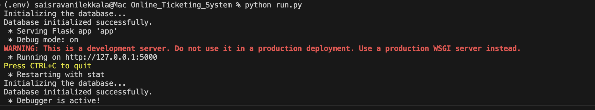
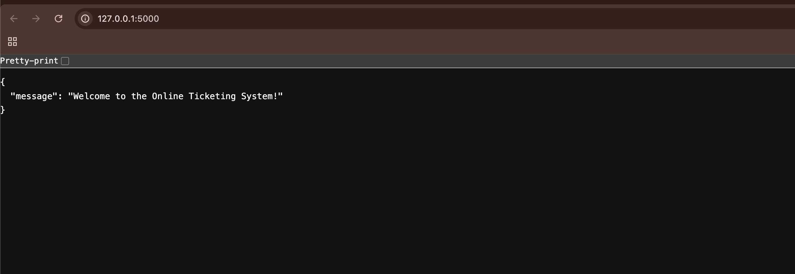
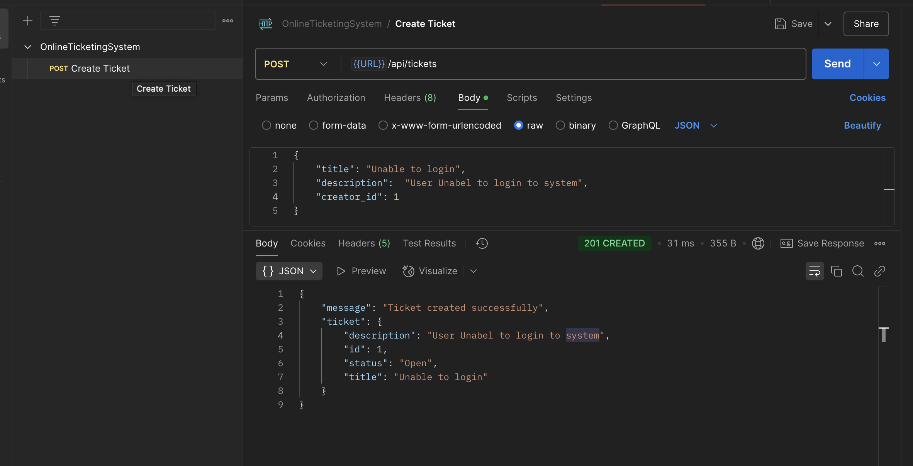
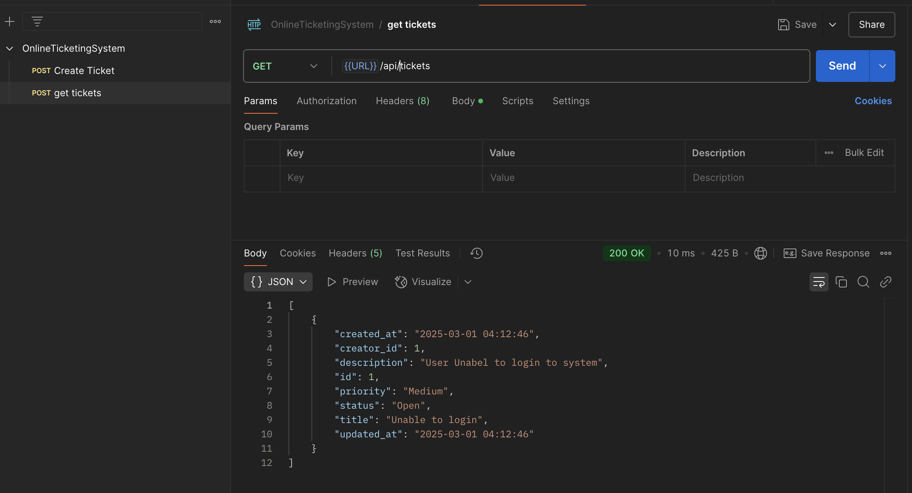

# Online Ticketing System

## 📌 Project Overview
This project is a Flask-based Online Ticketing System that allows users to create, manage, and track tickets efficiently.

---

## 📸 Screenshots

### **1️⃣ App Initialization**
This shows the application being initialized in the terminal.

### **2️⃣ Running Application in Browser**
The application running and accessible via the browser.

### **3️⃣ Creating a Ticket**
A demonstration of creating a new ticket using Postman.

### **4️⃣ Retrieving Tickets**
Fetching all tickets via the API.

